# Daily Learning log. 

I don't anticipate this being of much use to anyone (nor much long term use to even myself), but it's helpful to reflect on what I studied each day for a bit to help make it stick, and sometimes I write as if I'm attempting to explain the same concepts I read about to someone else, which also helps the ideas sick, even if I'm not going to be as complete in my explanation as the original source material.

## Mon 3/28, Tue 3/29

Back at chapter 2 of Python Machine Learning: after implementing the basic perceptron algorithm there's a follow up to implement a slightly more sophisticated single neuron model: ADAptive LInear NEuron (Adaline). 

With the original perceptron training function ([here's my implementation](https://github.com/krosaen/ml-study/blob/master/python-ml-book/ch02/perceptron.py), we determine how far we are off by subtracting the correct output with the predicted output *after* we've already gone through the activation function that pushes the value to 1 or -1, and the fact that the activation function does the quantizing means we've lost some resolution about how far we are off. This is where Adaline improves:


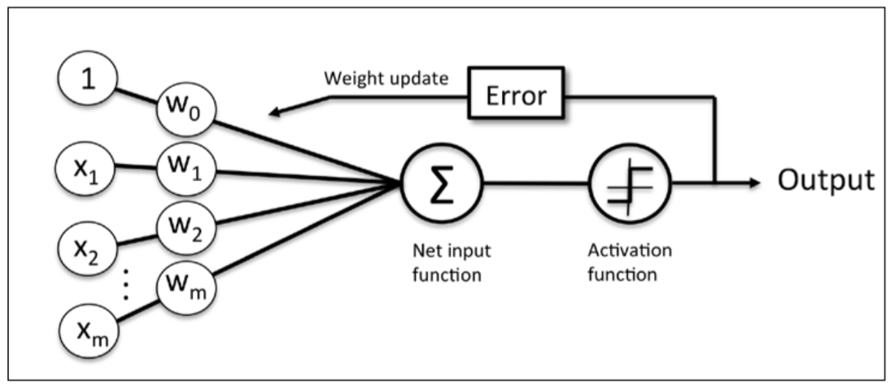

vs

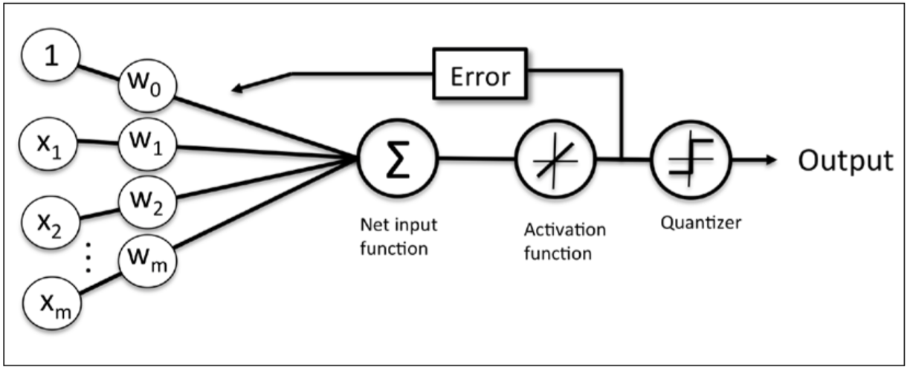

as the author puts it, "If we compare the preceding figure to the illustration of the perceptron algorithm that we saw earlier, the difference is that we know to use the continuous valued output from the linear activation function to compute the model error and update the weights, rather than the binary class labels."

The other difference in the adeline training procedure is it bases the weight delta based on the errors of every training observation at once instead of updating the weights one at a time. Again, the author, "the weight update is calculated based on all samples in the training set (instead of updating the weights incrementally after each sample), which is why this approach is also referred to as "batch" gradient descent."

Finally, the book goes into detail of framing the problem as minimizing a cost function. You start with some random weights (or all zeros) and see how far you are off on all of the training samples. Once you form a cost function to quantify how far you are off, you can think about updating a weights in order to minimize this cost:

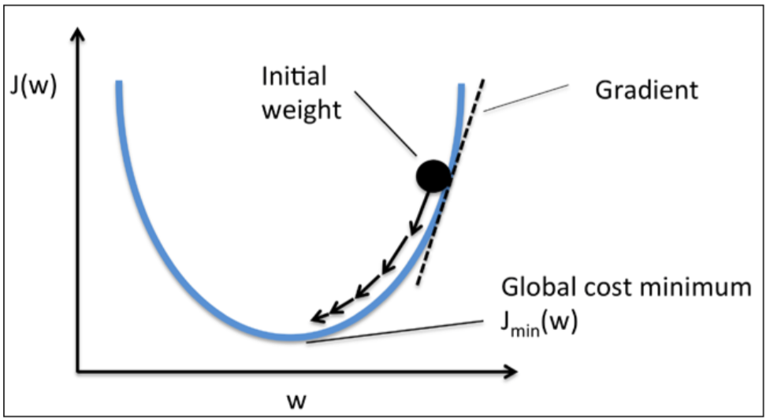

so each step is taking a little step down the curve, e.g "gradient descent". For this implementation I didn't look at the author's solution until I could figure it out myself, and also took the time to calculate the derivative of the cost function myself on paper, which dusted off the old [chain rule](https://www.math.ucdavis.edu/~kouba/CalcOneDIRECTORY/chainruledirectory/ChainRule.html) from calculus. 

In implementing / figuring out how to implement adeline, I got stuck for a while in figuring out how to vectorize the batch update calculation. All in all it was a good 2 hours of putzing around debugging the function until I got this one line figured out:

```
weight_deltas = learning_rate * np.dot(observations.transpose(), errors)
```

but I'm glad I went through this pain as I understand it much better than had I simply refactored a working solution as I did the first time. I also got stuck because I started out with too high of a training rate, so I thought there was a bug, but it turns out I was just bouncing around the cost function:

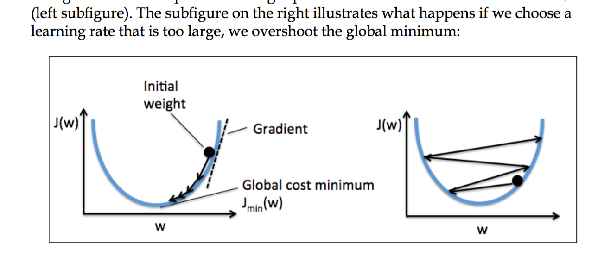


just as the book described a page later :) 


## Thu 3/24

I spent an hour flipping through [Python for Data Analysis](http://www.amazon.com/gp/product/1449319793) to see if anything caught my eye given I've spent some type with IPython notebooks, numpy and a little pandas, and in fact it became clear there's a way easier way to do some of the exploratory scatterplots that I was doing by hand yesterday. Here's [another notebook](https://github.com/krosaen/ml-study/blob/master/basic-stats/nba-player-stats/Pandas%20Scatter.ipynb) using a pandas data frame to load in the same nba player data set and quickly exploring two variable relationships using a scatter matrix.

I was avoiding using pandas for csv munging because it seemed like overkill, but I'm coming to appreciate its use even for a single csv; exploring a table of data is one of the things [pandas](http://pandas.pydata.org/) is really built for.

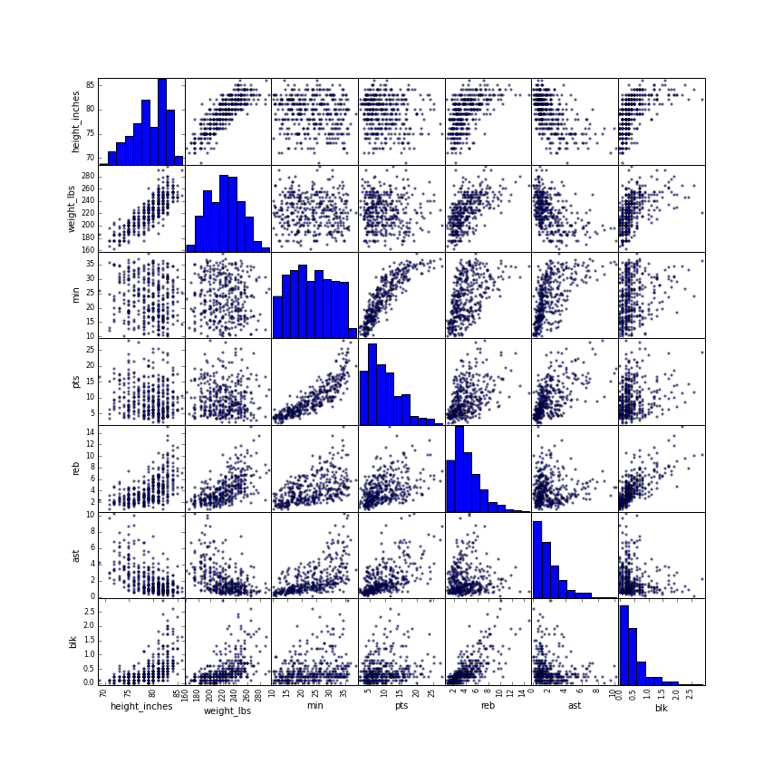

And now back to the python ML book for the rest of the day where we update the perceptron training to use gradient descent.

## Wed 3/23

To solidify the two variable analysis concepts from earlier in the week, spent some time looking at Q->Q comparison of player stats from the 2014-2015 NBA season (spent some time Monday getting the data set). 

- comparing two stat categories in a Q->Q scatter plots with best fit linear regression lines and correlation coefficients (also adding 3rd C dimension by labeling player positions)
- some C->Q comparisons of stats across guard / forward / center positions

IPython, numpy and scipy continue to shine, was really easy to find examples of making scatterplots and fitting regression lines, and has been fun getting my Python legs back. Check out the notebook [here](https://github.com/krosaen/ml-study/blob/master/basic-stats/nba-player-stats/NBA%20Player%20Stats.ipynb), here's a little example comparing the relationship between weight and rebounds per game:

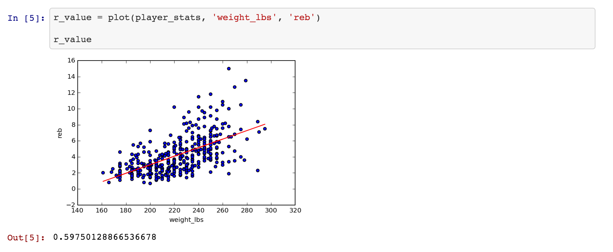

## Sampling

Towards end of day moved onto the next section of the stanford online class, [Producing Data: Sampling](https://lagunita.stanford.edu/courses/OLI/ProbStat/Open/courseware/pd_sampling/_m1_sampling/).

Sampling methods:
- simple random sampling: randomly choose N from population (equivalent to picking name out of a hat)
- cluster sampling: given a population divided into many groups, randomly choose N groups and use all members for your population
- stratified sampling: given a population divided into groups, randomly choose a subset within each group
- systematic sampling: choose at a regular interval, e.g every 50th person, or first person to walk in room each hour
- multi-stage sampling: first choose random cluster, then randomly choose within each (stratified limited to subset of clusters). could be more complicated chains of stages going between simple, cluster and stratified.

Crappy sampling methods:
- volunteer sample: ask a population to fill out a survey, only those who agree are included
- convenience sample: ask the next 5 people who walk by


## Mon 3/21

Reflecting back on last week, I spent 3 days on basic stats and 2 on the ML book. I'm really tempted to keep on 100% on the ML book, it's more fun :) But I believe having a strong foundation in probability and stats will be important in the long run as I get closer to the underlying stats for bayesian methods, graphical models etc. So I will resume with [Stanford's online course](https://lagunita.stanford.edu/courses/OLI/ProbStat/Open/info) and perhaps this week I will get far enough that it will begin to overlap with the [All of Statistics book](http://www.stat.cmu.edu/~larry/all-of-statistics/) that I intend to work through along with some problem sets available online within some of the CMU probability courses (e.g [here's one](http://www.stat.cmu.edu/~larry/=stat705/)), which begins with random variables, conditional probability and Bayes' theorem. 

The Stanford stats intro course is feeling borderline too elementary to bother with. However, I learn a couple of things here and there, and can move through it quickly, so I will continue on.

I also got the hang of IPython notebooks and some of the basic graphing functions from matplotlib. It's really a great tool and I'm really happy that Python / IPython / numpy / scikit-learn are among the most popular / powerful tools for data sciencey / ML stuff. On a related note, at the end of last week I picked up a couple of books: [Fluent Python](http://www.amazon.com/gp/product/1491946008) and [Python for Data Analysis](http://www.amazon.com/gp/product/1449319793). The first has been great for getting reacquainted with Python and some of the newer features of Python 3 after being away from it for a few years in Ruby land—I used Python for Real Time Farms before joining Food52, a (mostly) Ruby shop. The second will help give a broad overview of numppy, pandas and a few of the other tools that will be used often in the ML book and in exploring stuff within IPython notebooks. 

First impressions coming back to Python from Ruby: I love list comprehensions and slice syntax and have greater respect for the thought leaders in the Python community / find myself agreeing with the recommended way of doing things more often than with Ruby. But I'm already missing the symbol type (e.g for dictionary keys) from Ruby, as well as the  block syntax that makes threading data through a series of transformations via the functions available for all enumerable types in the standard library so nice. I will have to see if I can find a way to make expressing such computations as palatable in Python as I get back in more deeply. The libraries available for Python for scientific computing seem to be superior, whereas the community around web development in Ruby is prolific if occasionally sloppy. Python is the obvious choice for ML studies even though it looks like I [could](http://sciruby.com) [force it](https://github.com/SciRuby/iruby) with Ruby to a certain degree if I really wanted to.

A couple of other notes before I dive in today:

- I'd like to get a static website setup to host a blog and this learning log, but it doesn't seem pressing.
- I've been thinking that the 3rd prong of these studies will be a larger project and have plenty of ideas, but I think it makes sense to hold off for another week or two before alotting team each week for that. I'd like to have a bit more practical experience with the scikit-learn libraries first and also don't want to divert any time from probability / stats and the ML book studies until I have some more momentum.

### EDA: examining relationships

Last week was all about exploring distributions of a single variable / feature. The next section is about [examining relationships between two](https://lagunita.stanford.edu/courses/OLI/ProbStat/Open/courseware/eda_er/_m2_examining_relationships/). I imagine this will be scatterplots, and eye balling whether or not there appears to be a linear relationship.

- independent variable aka explanatory variable
- dependent variable aka response variable

Concepts:

- Explanatory / response (aka independent / dependent) variables. This is the variable's "role"
- Classify two variable data analysis scenario by its role-type (e.g C->Q is categorical -> quantitative)

Techniques:

- Identify explanatory and response variables given a description of a study or question (e.g in "does IQ influence favorite music genre", "music taste" is the response variable)
- Identify role-response from two variable 
- Visualize C->Q using side-by-side box-plots
- Examine C->C using tables and conditional percentages within explanatory variable values
- Examine Q->Q using scatter plots, placing explanatory variable on x-axis
- Examine a 3rd dimension on a scatter plot by labelling each point with its category
- Interpret the linear correlation two variables by looking at a scatter plot and the correlation coefficient. You should be able to get a sense of whether they are linearly related, and if so, whether it's a positive or negative relationship. The correlation coefficient quantifies the strength of the correlation as it's hard to assess this precisely by eye-balling it.

#### Role-type 

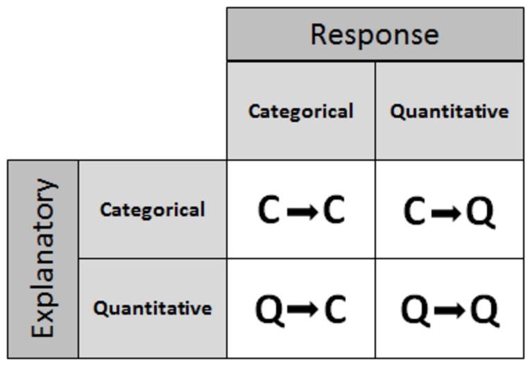

Two variable analysis can be classified by each of the variables type (categorical or quantitative) and which variable is the explanatory (independent) and which is the response (dependent):

- C->Q (categorical explanatory variable, quantitative response variable)
- C->C
- Q->Q
- C->Q

##### C->Q

When examining how a categorical variable affects a quantitative variable, it's similar to comparing multiple quantitative variables, and using a side by side box-plots to compare their distributions is the way to go, one for each category. The example in the course is looking at how the type of hotdog influences the calorie count.

When I [compared the distribution of margin of victory](https://github.com/krosaen/ml-study/blob/master/basic-stats/nba-games-net-rating-boxplots/NbaTeamGameNetRatingsPlots.ipynb) across 9 NBA teams in the eastern conference, that could be viewed as examining two variables: team (categorical) and margin of victory (quantitative).

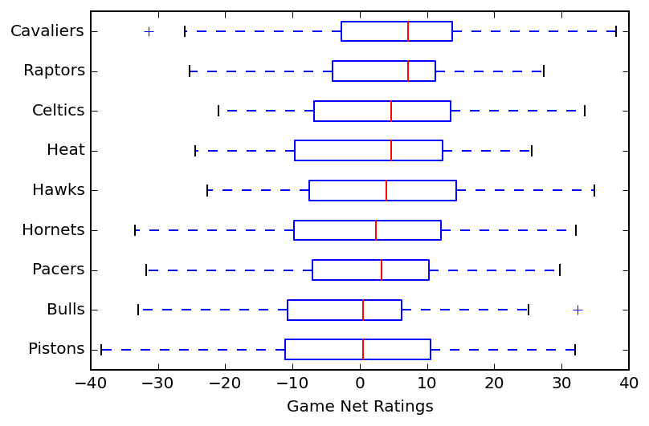

##### C->C

C->C can be examined with a 2 way table, rows are the explanatory, columns response, and each cell the value for that combination. The example in the course is examining the relationship between gender and body image (about right / overweight / underweight). The sum is provided for each row and column as well.

There may be a different number of data points available for each category, it's better to compare percentages than absolute numbers. In addition to the tabular form, visualizing these in a side-by-side bar chart helps too:

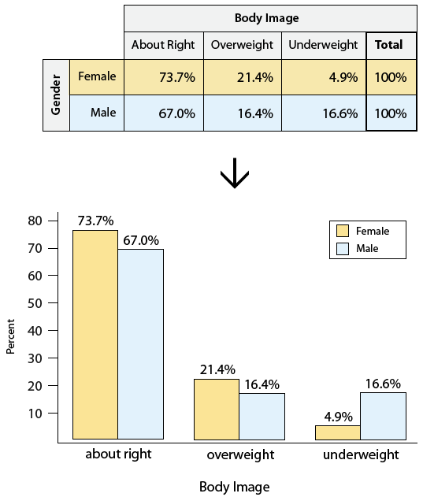

In choosing the percentages for each cell, the denominator should be the total for a given category of the explanatory variable. The course uses an example of looking at whether a student's smoking habits are influenced by their parents'. Here are the numbers:

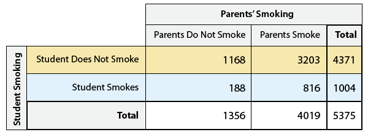

In order to see how the parents' choice influences their children, you want to show the percentages within each column (or "conditional column percentages")

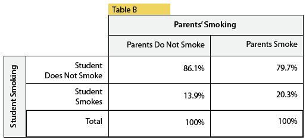

This allows one to quickly see that children of smokers are much more likely to smoke (20% vs 14%). 

Showing conditional row percentages isn't as useful as it's reversing the supposed affects (how much more likely is a parent to smoke given their child does):

** WRONG **

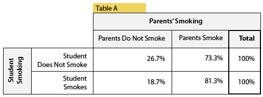


And showing percentages by dividing by the total number of students misses the point completely:

** WRONG **

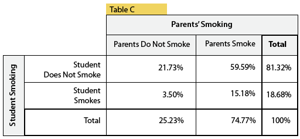

This also seems to me like the first foray into conditional probability; in these cases we're looking at what is the probability of an outcome of the response variable given a particular outcome of the explanatory variable.

##### Q->Q

When examining Q->Q relationship, we make a scatter plot with the explanatory variable on the horizontal x-axis. Similar to how we examine a distribution for a single variable: its shape, center, spread, and identifying outliers, we examine the scatterplot with an eye towards:

- direction: positive, negative?
- form: does there appear to be a relationship? Is it a linear or curve-linear one?
- strength: how strong? e.g how tightly do the points fit the general line?
- identifying outliers: which points do not match the overall relationship?

Here's an example plot examining age and how far from a sign an individual can be and still read it:

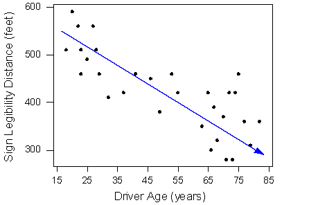

It has a moderately strong negative linear relationship and there don't appear to be any outliers.

In addition, you can examine another categorical variable atop a scatter plot by labeling it. Here's an example comparing two quantitative variiables, sodium and calories, and labeling them by category (meat, beef or poultry):

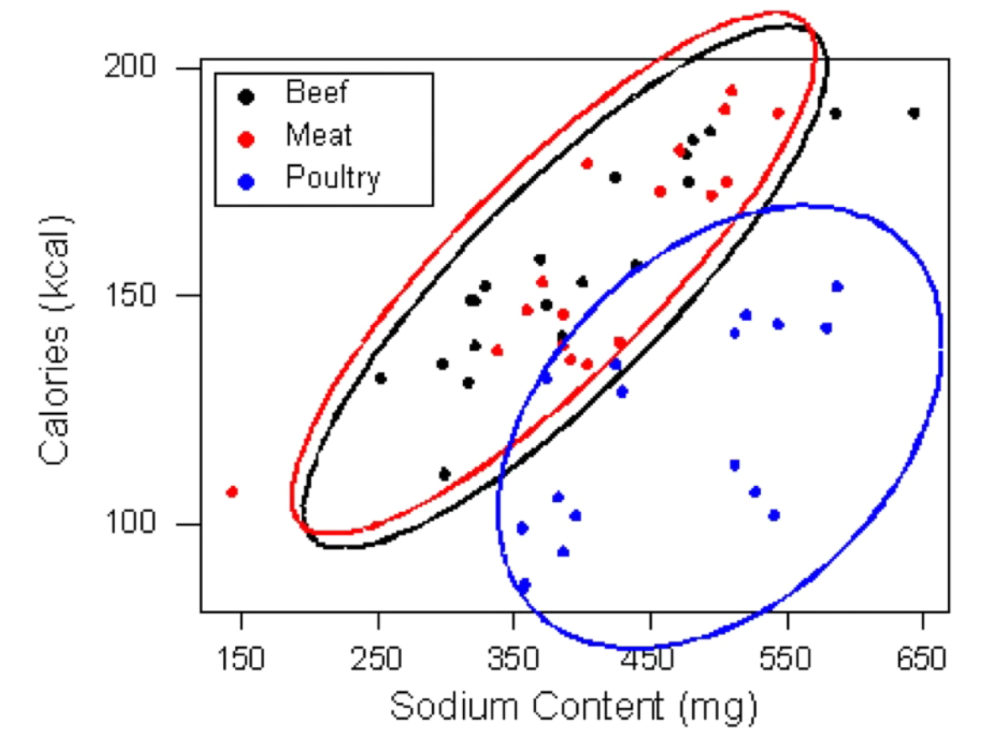

Side note: labeled scatter plots are common in the ML book as you are trying to learn a function that will recognize the labels and a 2-d plot is great for building intuition (even as in practice you are working with many more features).

##### Linear relationships

[Course section](https://lagunita.stanford.edu/courses/OLI/ProbStat/Open/courseware/eda_er/_m5_linear/)

Examining the strength of a linear relationship by eye balling a scatter plot is tough; for example the same data set viewed at different resolutions can look "stronger" to our eyes because it bunches together more closely.

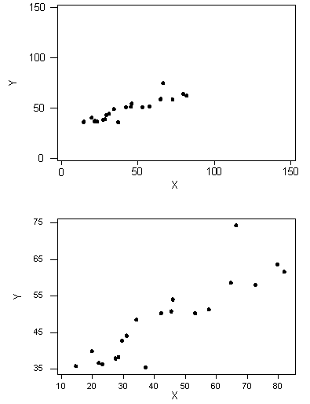

Instead we can look at a data set's correlation coefficient (r), which is calculated by taking the average of a pairwise computation of the two data sets, multiplying:

((xi - x_avg)/std_dev_x) * ((yi - y_avg)/std_dev_y))

For a given xi, we're looking at how much it deviates from the mean divided by the standard deviation which scales its deviation. A given xi should deviate from its mean by the same amount of the corresponding yi for xi and yi to be correlated.

The value ranges from -1 to 1, -1 being a very strong negative relationship, 0 being no relationship, 1 being a strong positive relationship. 

Some things about r:
- r is a unitless value.
- it only measures the strength of *linear* relationships; a perfectly fit quadratic will appear to have a weak linear relationship. So if r is 0, it only means the two variables have a weak *linear* relationship and it says nothing about general correlation.
- similarly, a value of r close to 1 or -1 is not sufficient to say the relation ship is linear; it could also be curve-linear (side note, "curve linear" seems like a hand wavy concept and I'm looking forward to getting more sophisticated)
- outliers can quickly take down r

###### Linear regression

The correlation coefficient is clearly limited, instead we can find the best fit line for a data set that minimizes the squared error. We can use this line / function to predict the value of the dependent variable for a given hypothetical value for the predictive variable.

The course runs through a review of algebra, slope intercept etc. Once you have the slope and intercept of the best fit line, you can use it to predict values of y for the x etc.

Important note: it is only considered prudent to predict values for inputs within the range of data used to compute the best fit line; e.g if your data set is looking at the ability to read a sign from a distance given age, and your data has entries for people ranging from 15 to 45, it is bunk to *extrapolate* and predict the distance of viewing for someone how is 60.

Interpolation is ok, extrapolation not so much. Obligatory XKCD reference:


##### Correlation

Yes correlation does not imply causation blah blah, there could be another "lurking" variable underlying the relationship. A scatterplot that shows clusters of data may indicate there's another variable that is important for understanding your data or that would have a higher correlation with your response variable.

##### Simpsons paradox

Adding in the lurking variable can reverse the previous direction of the association. That is, if you are looking just at A vs B (say, graduation rate vs college), you might see that people who attend one college (let's say MSU) have a higher graduation rate than another (let's say University of Michigan). It's possible that if you segmented the data by major, that in every single major, the graduation rate at umich is higher than MSU, even if the overall graduation rate at MSU is higher. This would be an instance of Simpsons Paradox, and underscores the danger of presuming causation.

Here's a nice clean example from [the wikipedia article](https://en.wikipedia.org/wiki/Simpson%27s_paradox).

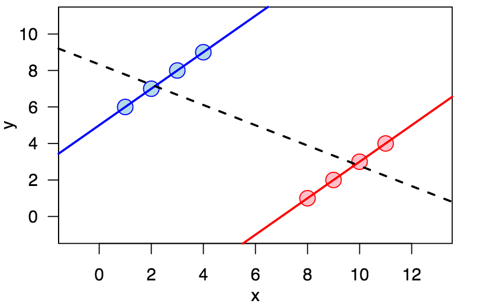

Adding in another variable can also help us deepen our understanding of a relationship even if the direction of the relationship does not change. 

IPython todos:

- show a table with percentages
- scatter plots
- labeled scatter plot
- plot least square regression line


## Fri 3/18

Kept at it with chapter 2 of the python ML book today, which covers implementing a basic single perceptron algorithm. It starts with one of the original training algorithms where the weights are updated using a scaling factor, and follows up with an improved approach using gradient descent: something that is core to many optimization steps across ML, including within the backpropogation algorithm of neural networks.

I took my time with it and refactored the author's OO solution into what I think is a cleaner one, both in terms of using a higher order function and in having that function capture the weights that are trained for *that* solution instead of having the prediction function rely on mutable weights ([my notebook](https://github.com/krosaen/ml-study/blob/master/python-ml-book/ch02/ch02.ipynb) and [the author's](https://github.com/rasbt/python-machine-learning-book/blob/master/code/ch02/ch02.ipynb)).

One thing that tripped me up was the helper function `plot_decision_regions`. I updated the training function to return a log of the weights as they evolved during the iterations, and I wanted to plot how the decision regions got closer to 100% during execution. However, it only seems to plot properly at the final step. I think I need to read more about matplotlib's contourf function before I can get to the bottom of it. For now, I think I'll move on.

## Thu 3/17

Switching gears today and beginning to work my way through Python Machine Learning. I read through this before but now want to go through it again more slowly, trying out each example myself and perhaps applying the techniques to new datasets as I go. I chose this book because it has a nice balance of conceptual background and practical application of libraries. It also has a great overview of the important details of applying an algorithm, including data pre-processing, dimensionality reduction, evaluating the model by comparing one trained on one portion of the dataset against an unseen segment (e.g does it seem to generalize), hyperparamter tuning etc. These concerns were also covered in Andrew NG's machine learning class that I took part of a couple of years ago and while I by no means remember everything from that course, I remember enough to know that this book does a good job covering these topics.

Working my way through this book and familiarizing myself with many of the algorithms available in scikit-learn is the 2nd of the 3 prongs in my ML curriculum, the first being stats and probability and the final being a larger project TBD (but ideas abound). 

Anyways, today it's chapters 1 and 2. Chapter 1 includes an overview of ML, how to get setup with the necessary tools and the like. I'm already setup with an install of python3, scikit-learn and Jupyter for IPython notebooks. I recommend using [anaconda](https://docs.continuum.io/anaconda/index) to quickly get setup with clean python installs, jupyter and the relevant libraries. I love jetbrains products and am using PyCharm for any python work not done directly in IPython notebooks. Every example in the book is [already available](https://github.com/rasbt/python-machine-learning-book) in notebook form, but I will work through [in my own](https://github.com/krosaen/ml-study/tree/master/python-ml-book) notebooks anyways.

### Chapter 1 notes

ML field overview:
- supervised learning: generalize from labeled data
  - classification: predicting categorical class labels (e.g spam, not spam, or is this the digit "1")
  - regression: predicting continuous value (e.g predicting house price). Note: from stats terminology, this would be predicting a quantitative "ratio" variable
- unsupervised learning: discover structure from unlabeled data
- reinforcement learning: improve performance in dynamic environment optimizing based on a reward signal

Comparing terminology from stats and ML:

- dataset aka feature matrix
- observation aka instance aka sample aka row aka x superscript i
- variable aka feature aka dimension aka attributes aka measurements aka column aka x subscript j

Predictive modeling overview

- preprocessing: feature extraction and scaling, feature selection, dimensionality reduction, sampling
- learning: 
  - model selection (e.g deciding among SVM, logistic regression, random forests...)
  - cross-validation: comparing performance on validation subset which is distinct from training subset to avoid overfitting and have a better shot at performing well in final evaluation stage
  - choosing performance metrics (e.g classification accuracy)
  - hyperparameter optimization: tuning the knobs of the model
- evaluation: how well does the tuned model perform on unseen test set?
- prediction: your model in the wild! applying tuned model to new data

One thing that's interesting to think about is how the dataset is segmented for different stages of this process. You separate training and validation sets right off the bat as you evaluate models and tune parameters. This makes sure you are not just fitting to the model that was used to generate / tune the model (e.g the weights of the nodes in a neural net). However, to make sure that you haven't overfit to the evaluation set during the tuning and model selection stages, there's one final check in the evaluation stage where you apply your model and tuned algorithm to a test set that was removed from all prior stages of the process.

It's also worth noting that hyperparameter tuning is tuning is not the same thing as optimizing the weights in whatever model you are training. From the book, "Intuitively, we can think of those hyperparameters as parameters that are not learned from the data but represent the knobs of a model that we can turn to improve its performance..."

### Chapter 2 notes

This chapter dives into implementing some basic learning algorithms based on a single perceptron. I spent a couple of hours running the same code as the book provides, but slowing down to grok it. I needed some background knowledge about numpy and pandas data structures including data frames and numpy's fast vectorized multi-dimensional arrays.

## Wed 3/16

Today I wrapped up playing with the NBA game net rating data set in a Jupyter IPython notebook ([on github](https://github.com/krosaen/ml-study/blob/master/basic-stats/nba-games-net-rating-boxplots/NbaTeamGameNetRatingsPlots.ipynb)). Not exactly setting the world on fire but was nice to get the basics going with Jupyter notebooks and to figure out how to make it viewable on github.

I also wrapped up the "examining distributions" section of the stanford stats class.

Concepts:

- The standard deviation is the average squared delta from the mean
- similar to mean it is heavily affected by outliers and best suited for symmetric datasets, otherwise box plots are likely better
- The standard deviation rule: for a normal distribution, 68% of the data falls within 1 std deviation of the mean, 95% fall within 2 and 99.7% fall within 3.

Techniques:
- calculate the standard deviation of a data set
- report what % fall within 1, 2 and 3 standard deviations
- Given mean and std deviation, apply standard rule to answer questions like: what range will 95% of the observations fall? What % of observations will fall above 1 std deviation from mean?

## Tue 3/15

Today I want to put one of the skills into practice by producing a box plot with some real data using a python notebook. I think it would be interesting to compare the box plots of the point delta for nba wins of various teams. 

## Mon 3/14

Today I'm continuing to plot my big picture curriculum focusing on three areas:

- probability and statistics fundamentals
- applied ML / inference techniques
- capstone: pick something cool I want to be able to do and work backwards

I've previously gathered a lot of relevant materials, but today discovered an additional resource for basic stats: [Stanfords free course](https://lagunita.stanford.edu/courses/OLI/ProbStat/Open/about). It is a very basic intro but I believe I can learn something from it as I also work through problem sets from the text "All of Statistics" that I found from CMU's [course from the author of the](http://www.stat.cmu.edu/~larry/=stat705/) and its more introductory CS counterpart [CS 36-700](https://www.dropbox.com/s/5xf2mfd7k6w0ipk/syllabus.pdf?dl=0) (note: I found materials elsewhere online months ago that now no longer appear to be online).

One question I got wrong off the bat in this basic stats course was in determining whether the variable 'ZipCode' from a dataset was categorical or quantitative: I chose 'quantitative' without thinking too much because there are a lot of possible options and I was thinking categorical would be a smaller finite set of choices, but this is wrong; zipcodes can't be summarized quantitatively, e.g no 'average' of zipcodes, so it is a categorical variable. Kind of embarrassing I didn't get this right, but hey, this is why it's good to start with the basics even as I dive into more advanced stuff in parallel.

Another course I took another look at today was [Stanford's statistical learning course](https://lagunita.stanford.edu/courses/HumanitiesSciences/StatLearning/Winter2016/about). It covers some of the same techniques I will be looking at as I work through [Python Machine Learning](https://www.packtpub.com/big-data-and-business-intelligence/python-machine-learning). I will check back to see if any of the videos help in my understanding as I proceed.

### Stats basics 

Today I covered basic exploratory analysis of categorical and continuous variables (up through measures of spread [here](https://lagunita.stanford.edu/courses/OLI/ProbStat/Open/courseware/intro/9476c98a36d34dec90e69994d367e554/). 

Concepts:
- data and variables
- summarizing data: histograms, measures of center (mean, mode, median), measures of spread and outliers

Skills & Techniques:
- determine whether a variable is categorical or quantitative (and more granularly, whether it is nominal, ordinal, interval or ratio)
- plot a histogram of a categorical variable in bar or pie form
- plot a histogram of a quantitative variable 
- produce a stem plot of a quantitative variable
- upon viewing a histogram, describe the data sets:
  - shape: uniform, unimodal, bi-modal
  - symmetry: centered, skewed right, skewed left
- determine the mode, median, mean of a quantitative variable (from the raw data or a histogram)
- have intuition about the relationship between median and mean based on its histogram (e.g skewed left will have a higher mean than median)
- determine the range of a dataset (from the raw data or a histogram)
- determine the interquartile range (IQR) of a data set
- determine whether a data point is considered an outlier based on its relationship to Q1, Q3 and the IQR (e.g if less than Q1 - 1.5 * IQR) 
- construct a box plot of a data set based in its min, q1, median, q3, max
- develop intuition for a dataset by viewing its box plot
- compare two or more datasets by plotting their box plots on the same graph next to each other
- calculate the standard deviation of a data set

#### Overview 

There's a nice diagram to outline the course that puts everything about the course into context. The course covers 4 aspects of statistics:


1. Getting / producing data: sampling from a population of "all" data to get a dataset.

2. Exploratory data analysis (EDA): sizing up and summarizing the data set to get a feel for its characteristics.

3 & 4: Probability and inference: drawing conclusions about the entire population from the observed data collected in our sample.


#### Data and variables

Data are pieces of information about an individual or object, and these pieces are organized into variables. A variable is a characteristic of an individual / object, such as eye color, age, number of hours spent studying for the final exam last for a particular course last fall, etc. 

Note: these are not to be confused with random variables, which assigns values to outcomes of a random experiment.

Note: I think the word I'd usually use for 'variable' here is 'feature'.

Variables can be classified as categorical or quantitative. Categorical variables classify an object into a distinct set of values which are not ordered or comparable in magnitude. Continuous variables have values that can be compared and quantified; taking the average for instance.

Variables can be further classified into 4 progressively quantifiable types by their scale of measurement.
- nominal: basic discrete categories
- ordinal: can be ordered
- interval: can be ordered, difference between two can be quantified
- ratio: has notion of zero value. Can find the mean.

#### Summarizing data: examining distributions

##### One categorical variable

Histograms: number of items in each category.

##### One quantitative variable

- histograms but need to pick bins
- stem plots: an algorithm for creating a histogram like visualization by slicing by decimals, which guides you to choosing the size of the bins. Also useful because it preserves the data (each datum is stacked and visible in the plot)
- measures of center: mean, median mode. Mean is only appropriate when data is symmetric without outliers, median is better otherwise
- measures of range
  - range
  - inter-quartile range: median of top half - median of bottom half = Q3 - Q1
    - data below q1 - 1.5*IQR or above q3 + 1.5 IQR considered outliers
    - outliers shouldn't necessarily be discarded; only if they are suspected to be due to conditions that will not be repeated again or through error in collection. Outliers may be essential to the data, e.g a high magnitude earthquake.
  - box plots: visual presentation of min, q1, median, q3, max (the "five number summary") constructed by drawing dashes for each of these 5 summary numbers, and then a box around the q1 through q3.
  - standard deviation


